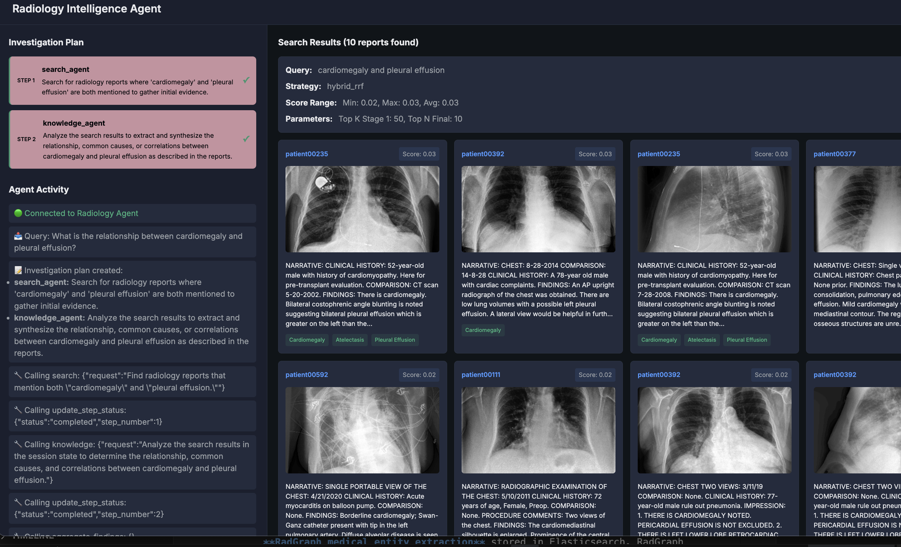
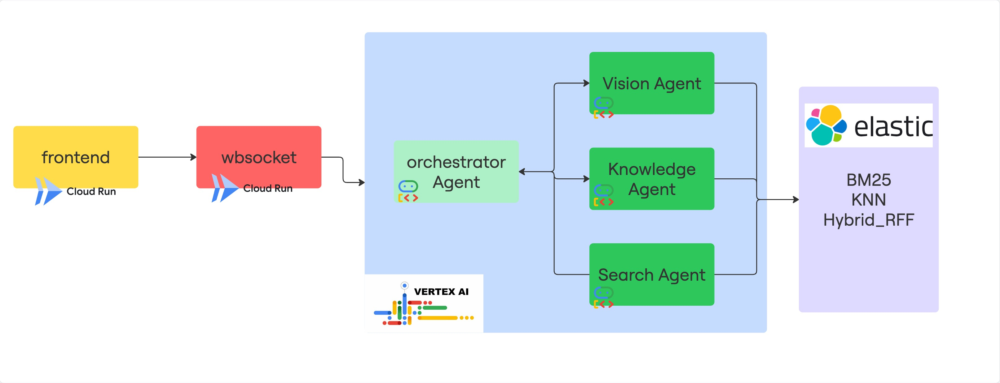

# Levia: Multi-Agent Radiology Intelligence System 🤖

**Google Cloud x Elastic Hackathon Project**

Levia is a hierarchical multi-agent AI system that combines **Google Cloud Vertex AI Agent Engines** with **Elastic Search's hybrid search capabilities** to deliver intelligent, conversational radiology report analysis and case retrieval. This project demonstrates the powerful synergy between Google Cloud's generative AI tools and Elasticsearch's advanced search infrastructure.

## Video Link:

## Image Gallery:


## Try link: 
https://radiology-frontend-555009189141.us-central1.run.app/


---

## 🎯 Hackathon Challenge: Elastic + Google Cloud

**Challenge**: Build the Future of AI-Powered Search using Elastic's hybrid search capabilities and seamless integration with Google Cloud's generative AI tools.

**Our Solution**: A conversational multi-agent system that transforms how clinicians interact with radiology data through:

✅ **Elastic's Hybrid Search (BM25 + kNN + RRF)**: Intelligent retrieval combining keyword precision with semantic understanding
✅ **Google Cloud Vertex AI**: Multi-agent orchestration powered by Gemini models
✅ **Multi-modal Intelligence**: Text and image vector search for comprehensive clinical insights
✅ **Real-time Conversational Interface**: Deployed on Google Cloud Run with WebSocket streaming
✅ **Structured Medical Knowledge**: RadGraph entities and CheXbert labels stored in Elasticsearch

This solution reimagines clinical decision support by making complex medical data accessible through natural conversation, powered by the combined strengths of Elasticsearch and Google Cloud.

---


### System Diagram



`levia` is a sophisticated orchestrator agent that coordinates three specialized sub-agents to answer complex clinical questions:

- **Orchestrator Agent**: High-level coordinator powered by **Google Gemini** that understands queries, creates investigation plans, and delegates tasks to specialized sub-agents
- **Search Agent**: Retrieves relevant radiology reports using **Elasticsearch's adaptive search strategies**:
   - **BM25 keyword search** for precise medical terms and acronyms (e.g., "pneumothorax", "CHF")
   - **kNN semantic search** for conceptual queries using 768-dimensional text embeddings (e.g., "collapsed lung", "fluid patterns")
   - **Hybrid RRF (Reciprocal Rank Fusion)** combining both strategies for complex mixed queries (e.g., "cardiomegaly with fluid patterns")

- **Knowledge Agent**: Analyzes medical findings and relationships using **RadGraph medical entity extraction** stored in Elasticsearch. RadGraph provides structured clinical insights (anatomical entities, observations, relationships) that enable deeper pattern analysis beyond what traditional LLMs can achieve from unstructured text alone.

- **Vision Agent**: Finds visually similar X-ray images using **Elasticsearch's kNN semantic search** on 1408-dimensional image embedding vectors, enabling feature-based similarity matching beyond keyword descriptions.

All agents are deployed together as a single hierarchical system to **Google Cloud Vertex AI Agent Engines**.

**Deployment Architecture:**
- **Agents**: Deployed on Google Cloud Vertex AI Agent Engines
- **Backend**: WebSocket server deployed on Google Cloud Run for real-time streaming responses
- **Frontend**: React application deployed on Google Cloud Run
- **Data Infrastructure**: Elastic Cloud instance with radiology reports, medical entities, and multi-modal embeddings


**Key Features:**
- **Google Cloud Integration**: Hierarchical agent delegation using Google ADK's `AgentTool` and Vertex AI deployment
- **Elasticsearch Power**: High-performance hybrid search combining traditional BM25 with modern semantic vector search
- **Multi-modal Embeddings**: Separate text (768-dim) and image (1408-dim) vectors for comprehensive similarity matching
- **Structured Medical Data**: RadGraph entity extraction and CheXbert labels for clinical insights
- **Session State Management**: Shared context across all agents for coherent multi-turn conversations
- **Real-time Streaming**: WebSocket-based streaming responses with progress updates

## Why Elasticsearch is Critical to This Project

Elasticsearch is the backbone of Levia's intelligence, enabling capabilities that would be impossible with traditional databases or simple vector stores. Here's how Elasticsearch powers this multi-agent system:

### 1. **Hybrid Search Strategy (The Game Changer)**

Traditional search tools force you to choose between keyword matching OR semantic similarity. Elasticsearch's **Reciprocal Rank Fusion (RRF)** combines both intelligently:

- **BM25 Keyword Search**: Precision for exact medical terminology like "pneumothorax", "CHF", or specific acronyms
- **kNN Vector Search**: Understanding for natural language queries like "collapsed lung" or "heart enlargement with fluid"
- **Hybrid RRF**: Automatically balances both approaches, providing the best of both worlds

**Example**: Query "cardiomegaly with pulmonary edema"
- BM25 finds exact mentions of "cardiomegaly"
- kNN finds semantically similar concepts ("enlarged heart", "cardiac dilation")
- RRF ranks results that satisfy both criteria higher, providing superior relevance

### 2. **Multi-Modal Vector Search**

Elasticsearch stores and searches across multiple embedding types simultaneously:

```json
{
  "text_vector": {
    "type": "dense_vector",
    "dims": 768,
    "similarity": "cosine"
  },
  "image_vector": {
    "type": "dense_vector",
    "dims": 1408,
    "similarity": "cosine"
  }
}
```

This enables:
- **Text-based semantic search** for finding similar clinical descriptions
- **Image-based similarity search** for finding visually similar X-rays
- **Cross-modal retrieval** combining text queries with visual similarity

### 3. **Structured Medical Knowledge Integration**

Elasticsearch's flexible schema stores both unstructured text AND structured medical entities:

- **RadGraph Entities** (keyword fields): Anatomical structures, clinical observations, and their relationships extracted from reports
- **CheXbert Labels** (object fields): Standardized pathology classifications (e.g., cardiomegaly, edema, pleural effusion)
- **Full-text Reports** (text fields): Complete radiology reports.

This multi-layered data structure allows the Knowledge Agent to perform sophisticated pattern analysis that pure LLMs cannot achieve.


### The Bottom Line
This project showcases how **Elasticsearch + Google Cloud Gemini** creates a synergy greater than the sum of its parts:
- **Elasticsearch** provides the intelligent retrieval infrastructure with hybrid search, multi-modal vectors, and structured data
- **Google Cloud Vertex AI** provides the conversational intelligence, reasoning, and multi-agent orchestration
- Together, they deliver a **context-aware, intelligent, and interactive** clinical decision support system

Without Elasticsearch's hybrid search and multi-modal capabilities, this multi-agent system would be limited to simple text matching or pure LLM hallucination. Elasticsearch grounds the AI in real clinical data while maintaining the speed and flexibility needed for interactive conversations. 

